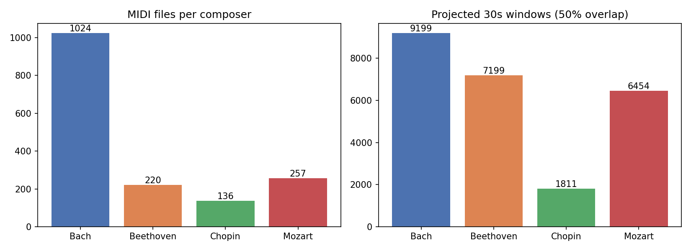
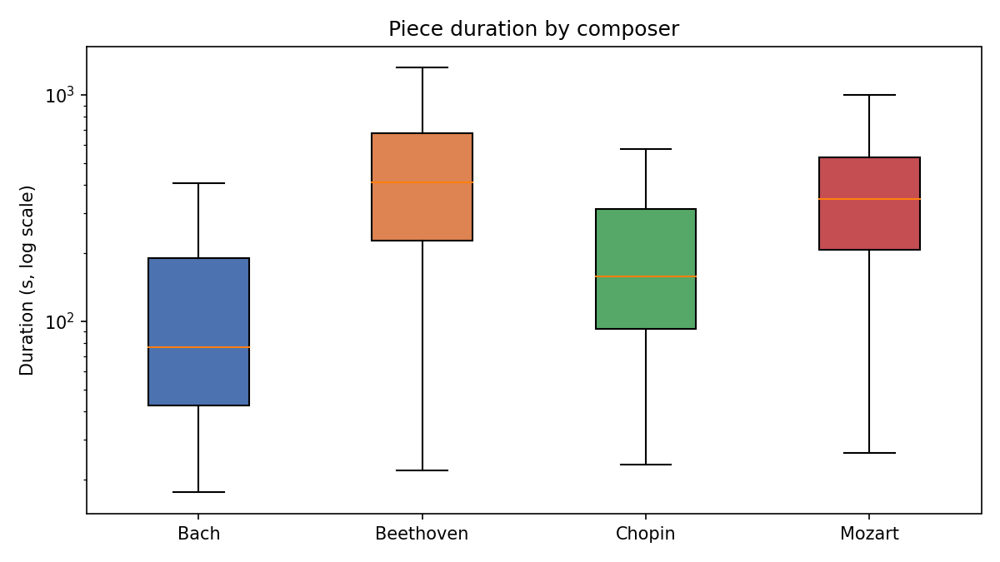
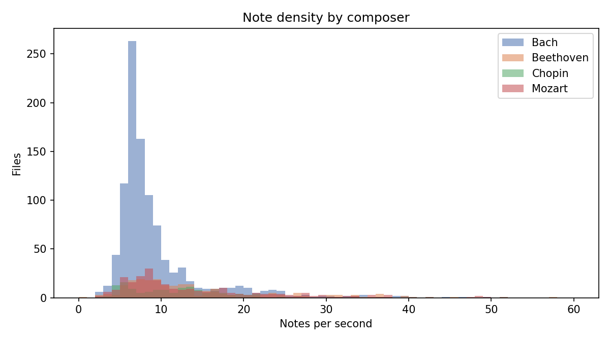
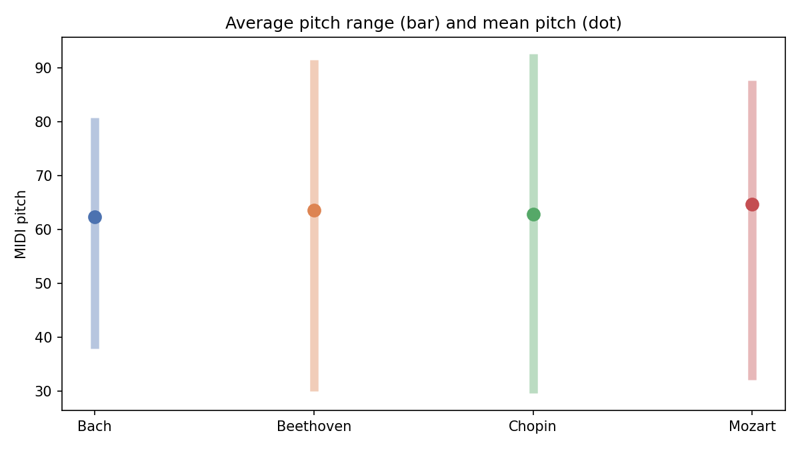
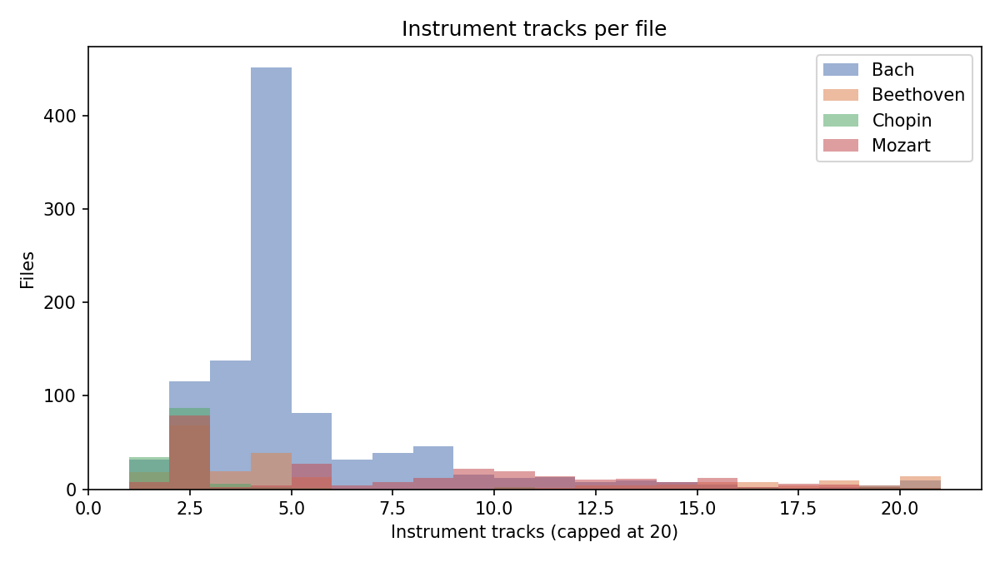

# EDA Report — Composer Classification Dataset

Source: Kaggle `blanderbuss/midi-classic-music`, filtered to Bach, Beethoven, Chopin, Mozart.

- Total files: **1637**
- Parsed OK: **1635** | Corrupt/unparseable: **2**
- Exact byte-duplicates: **21** groups (42 files), cross-composer: **0**

## Per-composer summary

| composer   |   files |   total_hours |   median_dur_s |   mean_notes |   mean_notes_per_sec |   mean_instruments |   windows |
|:-----------|--------:|--------------:|---------------:|-------------:|---------------------:|-------------------:|----------:|
| Bach       |    1024 |         44.44 |          76.8  |      1733.61 |                 9.44 |               4.79 |      9199 |
| Beethoven  |     219 |         31.32 |         410.36 |      7707.08 |                14.19 |               6.93 |      7199 |
| Chopin     |     136 |          8.34 |         157.51 |      2350.76 |                11.21 |               2.45 |      1811 |
| Mozart     |     256 |         28.5  |         347.83 |      5383.55 |                13.83 |               7.34 |      6454 |

## Projected window share (class balance for training)

| composer   |   window_% |
|:-----------|-----------:|
| Bach       |       37.3 |
| Beethoven  |       29.2 |
| Chopin     |        7.3 |
| Mozart     |       26.2 |

## Corrupt files

|    | composer   | filename                       | error                                                             |
|---:|:-----------|:-------------------------------|:------------------------------------------------------------------|
|  0 | Beethoven  | Anhang 14-3.mid                | KeySignatureError: Could not decode key with 3 flats and mode 255 |
|  1 | Mozart     | K281 Piano Sonata n03 3mov.mid | KeySignatureError: Could not decode key with 2 flats and mode 2   |

## Duplicate groups (first 30)

|    | md5                              | composer   | filename                                                                 |
|---:|:---------------------------------|:-----------|:-------------------------------------------------------------------------|
|  0 | 00c41bdf010581753ce2bedd7138d5f9 | Bach       | 015804b_.mid                                                             |
|  1 | 00c41bdf010581753ce2bedd7138d5f9 | Bach       | 027900b_.mid                                                             |
|  2 | 22509d610ed79ff8e2dce6977deb7a78 | Mozart     | Viennese Sonatinas K439b n2 2mov.mid                                     |
|  3 | 22509d610ed79ff8e2dce6977deb7a78 | Mozart     | Sonatina n22 4mov.mid                                                    |
|  4 | 225314d72503d0cbfc903ab0e97059fa | Beethoven  | Sonata Presto.mid                                                        |
|  5 | 225314d72503d0cbfc903ab0e97059fa | Beethoven  | Piano Sonatina No.2 Op 49.mid                                            |
|  6 | 4de19d48dfafbd1fa4967854b65c4ea5 | Bach       | 007607b_.mid                                                             |
|  7 | 4de19d48dfafbd1fa4967854b65c4ea5 | Bach       | 007614b_.mid                                                             |
|  8 | 4f8ea7cab4418e933589aa90698d332e | Beethoven  | Sonata for Piano & Cello n2 op05.MID                                     |
|  9 | 4f8ea7cab4418e933589aa90698d332e | Beethoven  | 137.MID                                                                  |
| 10 | 51975a3b48790473b6ca4dcd30c6e67b | Mozart     | Sonatina n21 3mov.mid                                                    |
| 11 | 51975a3b48790473b6ca4dcd30c6e67b | Mozart     | Viennese Sonatinas K439b n2 1mov.mid                                     |
| 12 | 5537f4c6d2598aa2c3dba8ffa085725c | Chopin     | Etude op10 n07.mid                                                       |
| 13 | 5537f4c6d2598aa2c3dba8ffa085725c | Chopin     | Etude No.7 in C Major Opus.10, No.7.mid                                  |
| 14 | 56e0153fd5249f731355d6c9efeceda6 | Chopin     | Nocturne op55 n1.mid                                                     |
| 15 | 56e0153fd5249f731355d6c9efeceda6 | Chopin     | Nocturne No.15 in F Minor Opus.55 -1.mid                                 |
| 16 | 66169be8ab2c37d0ac9326e74172b047 | Beethoven  | Piano Sonata No2 Assai vivace.mid                                        |
| 17 | 66169be8ab2c37d0ac9326e74172b047 | Beethoven  | Piano Sonata No 28 in B flat -Hammerklavier- Op.106, 2nd Mov Scherzo.mid |
| 18 | 72b145de9a9a5dcc5af4a1658192dea2 | Bach       | 014710b_.mid                                                             |
| 19 | 72b145de9a9a5dcc5af4a1658192dea2 | Bach       | 014706b_.mid                                                             |
| 20 | 8670fa9096c501577788640f546d3e35 | Beethoven  | Sieben Bagatellen, in D Major, Opus.33, No.6.mid                         |
| 21 | 8670fa9096c501577788640f546d3e35 | Beethoven  | Bagatella op33 n6.mid                                                    |
| 22 | 88558e61a5a45d896b26944f8b6828ac | Beethoven  | Sieben Bagatellen, in A Major, Opus.33, No.4.mid                         |
| 23 | 88558e61a5a45d896b26944f8b6828ac | Beethoven  | Bagatella op33 n4.mid                                                    |
| 24 | 935082c81c63de62124bbea19832e3dd | Bach       | 022701b_.mid                                                             |
| 25 | 935082c81c63de62124bbea19832e3dd | Bach       | 022711b_.mid                                                             |
| 26 | 9589723c83faa9ed580886b9fdfa6ebf | Bach       | 007507b_.mid                                                             |
| 27 | 9589723c83faa9ed580886b9fdfa6ebf | Bach       | 007514b_.mid                                                             |
| 28 | 96094e6f481f4a5b46b3094b87407619 | Bach       | 017507b_.mid                                                             |
| 29 | 96094e6f481f4a5b46b3094b87407619 | Bach       | 005903b_.mid                                                             |

## Figures

