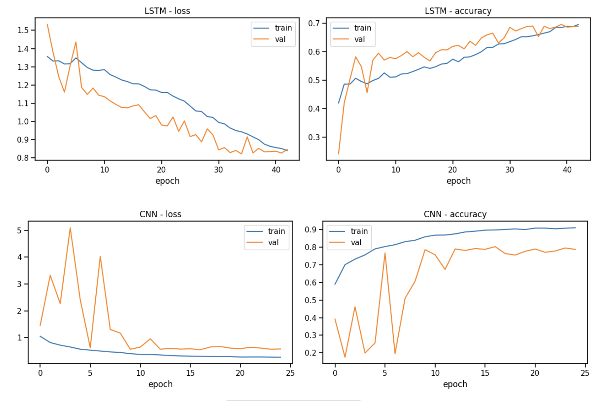
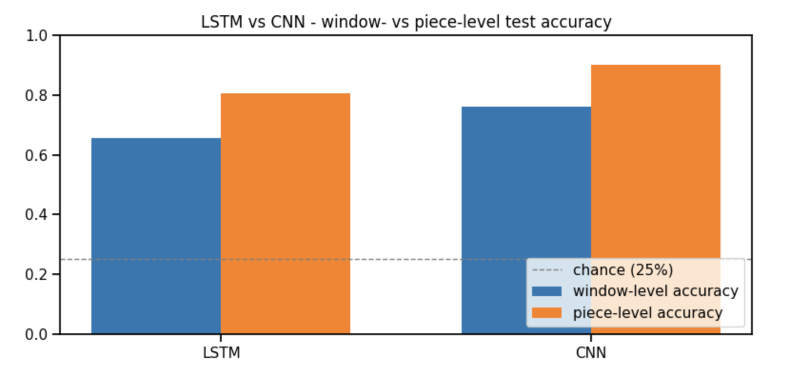
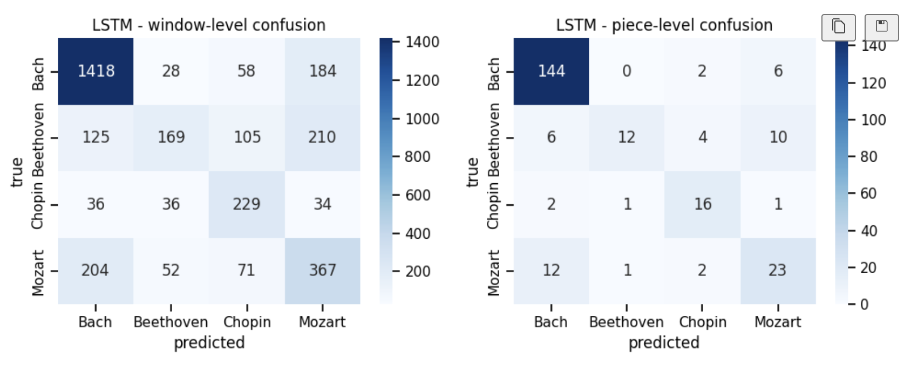
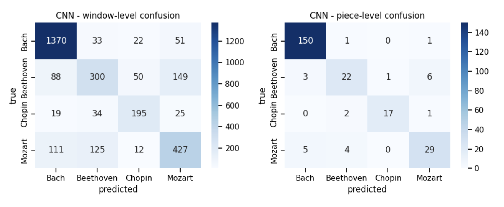

Predicting Music Composers using Deep Learning Models
Maxime Boulat, Robert Shifrin and Francisco Monarrez Felix
Shiley-Marcos School of Engineering, University of San Diego
AAI-511: Neural Networks and Deep Learning
Dr. Andrew Van Benschoten
August 10, 2026

# Abstract

In this paper, we develop a music classification pipeline with deep learning models. Two neural network architectures are chosen: a Convolutional Neural Network (CNN) and a Long Short-Term Memory (LSTM). Using a curated dataset of tracks, we implement a complete pipeline encompassing data collection, preprocessing, feature extraction, model training, hyperparameter optimization, and evaluation. We find that both models can learn the hidden representations in the data and perform well at the classification task. These results demonstrate that spatial representations of musical structure are particularly effective for composer identification and highlight the continued effectiveness of neural networks for music analysis.

# Introduction and literature review

Music as a medium a offers a unique and fertile playground for data science and deep learning experimentation. Not only is it naturally well suited to be broken down into bite sized chunks, but it comes pre-labeled, there exists a large quantity of it in the wild and musicians carry their unique identifying information across their musicography.

The science of analyzing music to extract meaningful information from it (Musical Information Retrieval, MIR) is not new and finds its origins in the science of speech recognition. Before the advent of Deep Learning, and as is the case for other fields of study such as computer vision and Natural Language Processing, researchers relied heavily on handcrafted features which were either used directly to compare against known thresholds, or used to train classical classifiers such as Logistic Regression, Decision Trees or Support Vector Machines. Foote (1997) proposed to use MFCC coefficients to construct a learning tree vector quantizer, which could then be used to produce a unique signature for each track. Similarity search could then be performed on the resulting signatures. Tzanetakis and Cook (2002) outlined a series of mathematical formulas to extract uniquely identifying features from musical tracks for genre classification. 

The deep learning revolution kicked off by Krizhevsky et al. (2012) with AlexNet extended to MIR and CNNs became the de facto gold standard for music classification (with musical track data converted to "image" data). However it was widely believed that the raw audio data needed to be converted to a spectrogram before ingestion. Dieleman and Schrauwen (2014), were the first to demonstrate that CNNs were able to process raw music audio directly and learn how to extract the prominent features directly from it.

In this paper, we propose to implement a musical classification system which can correctly predict the composer for a given track out of 4 possible composers. We propose to use two different deep neural network architectures to that effect: a CNN architecture and a LSTM architecture. As a model able to identify hierarchical patterns in image-like data, the CNN is uniquely positioned to recognize recurring complex patterns such as chord voicing, voice spacing, rhythmic density, and register specific to each composer. The LSTM, in turn, is specially designed to recognize patterns in time-series or sequential data thanks to the recursiveness of its processing loop, and is therefore particularly well suited for analyzing music.

First, we discuss data collection and pre-processing, then the feature extraction step that converts cleaned MIDI files into the pitch-token and piano-roll representations each model consumes. We then describe the CNN and LSTM architectures, the training procedure, and the window- and piece-level evaluation used to compare them, before optimizing each model's hyperparameters and analyzing the results.

# Data Collection

The data used in the experiment was obtained from a public dataset hosted on Kaggle consisting of 3,929 MIDI files organized by composer (Fedorak, 2019). This original batch was filtered down to contain only the four main composers: Bach, Beethoven, Chopin, and Mozart, which left 1,637 files total.

Some basic data hygiene was performed on the raw data, with duplicates (identified with MD5 hashing) and unusable files removed.

Then the entire folder was traversed and every track inventoried into a tracking table where every track was mapped to its physical file and assigned the correct composer class label according to its position in the file hierarchy.

This allowed us to perform some exploratory analysis, as illustrated in Table 1.

**Table 1**

*Per-Composer Profile*

| Composer  | Full corpus files | Usable (after cleaning) | Median duration (s) | Mean notes/s | Mean instruments |
| --------- | ----------------- | ----------------------- | ------------------- | ------------ | ---------------- |
| Bach      | 1,024             | 1,012                   | 77                  | 9.4          | 4.8              |
| Beethoven | 220               | 213                     | 410                 | 14.2         | 6.9              |
| Chopin    | 136               | 132                     | 158                 | 11.2         | 2.5              |
| Mozart    | 257               | 254                     | 348                 | 13.8         | 7.3              |

Bach's file count (1,024) dwarfs the other three composers combined (613), while its median piece duration (77 s) is the shortest by a wide margin. The class imbalance was addressed as part of data preprocessing.

# Data Pre-processing

In order to maximize the quantity, consistency and diversity of samples that could be extracted from the MIDI tracks, it was decided to adopt a windowing strategy where each track was broken down into overlapping chunks of fixed length. These chunks, called windows, formed the basis of the sample space that was used to train and test the models in this experiment.

Because each model type has different data requirements, the way the windows were created from the raw files differed according to which model they were intended for.

For the LSTM, the windows were measured by quantity of notes, since an LSTM ingests a sequence of values. Each window was made to be 100 notes long with a stride of 50. For the CNN, since the input format would be a 2D image representation of the data, a fixed time interval served as the boundary, with each window made to span 16 seconds (128 frames at 8 fps), with a stride of 64 frames.

It is important to note that the conversion of MIDI tracks into windows was performed after the train-test split, to avoid leakage of data from the same track across training and testing. In addition the train-test split was performed using a stratified split to preserve the class representation of the original dataset.

In addition to windowing, the data was augmented using random pitch transposition during training with each window getting transposed by a randomly selected factor between -2 and 2 for each epoch.

Finally, the remaining class imbalance was mitigated by using inverse-frequency weights based on the frequencies observed in the training windows, as shown in Table 2.

**Table 2**

*Training Window Class Frequencies and Inverse-Frequency Weights*

| Composer  | LSTM windows | LSTM % | LSTM weight | CNN windows | CNN % | CNN weight |
| --------- | ------------ | ------ | ----------- | ----------- | ----- | ---------- |
| Bach      | 8,299        | 51.9%  | 0.482       | 7,371       | 50.0% | 0.500      |
| Beethoven | 2,732        | 17.1%  | 1.464       | 2,679       | 18.2% | 1.375      |
| Chopin    | 1,666        | 10.4%  | 2.401       | 1,428       | 9.7%  | 2.580      |
| Mozart    | 3,305        | 20.7%  | 1.210       | 3,260       | 22.1% | 1.130      |

# Feature Extraction

The conversion of MIDI tracks into windows already hints at the direction in which feature extraction went in this project. 

For the LSTM, all the notes except for percussion were extracted from the MIDI file, arranged as a vector of pitch values sorted by time and everything else was discarded. This was assumed to be enough to preserve the underlying structure of the music and its composer's specific style.

For the CNN, all the notes (except percussion) were positioned on a 2D canvas defined by time on the x-axis pitch on the y-axis, effectively turning the windows into images.

Each window also carried the id of its source file, which is what made piece-level evaluation (Model Evaluation, below) possible. 

# Model Building

The LSTM began with an embedding layer mapping the 129 possible pitch tokens (the 128 MIDI pitches plus one padding index) to a 64-dimensional vector. Two stacked LSTM layers of 128 and 64 units, each with dropout applied, modeled the temporal structure of the sequence. A dense layer of 64 units with a ReLU activation and a further dropout layer preceded the final four-way softmax output. This architecture totaled 160,900 trainable parameters (628.52 KB).

The CNN was built around three convolutional blocks, each combining a 3×3 convolution — with 32, 64, and 128 filters, respectively — batch normalization, and max pooling. A global average pooling layer then collapsed the resulting feature maps before a dense layer of 128 units with a ReLU activation, a dropout layer, and the final softmax output. This architecture totaled 110,596 parameters, of which 110,148 were trainable and 448 were non-trainable batch-normalization statistics (432.02 KB).

Both were trained with the Adam optimizer using sparse categorical cross-entropy as the loss function. A batch size of 64 for up to 60 epochs was chosen as was the use of early stopping on validation loss, with a patience of 8 epochs and restoration of the best-performing weights, and a learning-rate reduction that halved the learning rate after 3 stalled epochs, down to a floor of 1e-5.

# Model Training

As shown in Figure 1, the training histories for both models show a steady convergence toward an optimum, with the best checkpoint reached at epoch 35 with validation loss 0.82 and validation accuracy 0.69 for the LSTM, and at epoch 17 with validation loss 0.55 and validation accuracy 0.80 for the CNN. Besides early wild fluctuations on the validation set for the CNN which stabilized around epoch 10, both training histories show a healthy trend indicating that both models were able to learn from the data without overfitting.

**Figure 1**

*Training and Validation Loss and Accuracy Curves for the LSTM and CNN Models*

# Model Evaluation

Evaluation was conducted on the held-out test split, which was never used during training or model selection, at two levels: window level, where every window is scored independently, and piece level, where a file's window probability vectors are averaged and the argmax is taken to produce one prediction per piece. Piece-level evaluation is closer to how the model would actually be used, and was only possible because each window carried the id of its source file throughout the pipeline.

Table 3 summarizes the final model comparison on the test set. The chance baseline for four classes is 25%. The CNN reached 90.1% piece-level accuracy, 3.6 times above chance, while the LSTM reached 80.6%, 3.2 times above chance. Piece-level aggregation lifted both models well above their window-level scores (by 14.9 points for the LSTM and 14.0 points for the CNN), consistent with independent per-window errors averaging out. As shown in Figure 2, the CNN outperformed the LSTM on every metric at both levels.

**Table 3**

*Model Comparison on the Test Set*

| Model | Window acc | Window macro F1 | Window weighted F1 | Piece acc  | Piece macro P | Piece macro R | Piece macro F1 |
| ----- | ---------- | --------------- | ------------------ | ---------- | ------------- | ------------- | -------------- |
| LSTM  | 0.6563     | 0.5655          | 0.6446             | 0.8058     | 0.7442        | 0.6819        | 0.6875         |
| CNN   | **0.7612** | **0.7001**      | **0.7551**         | **0.9008** | **0.8591**    | **0.8219**    | **0.8393**     |

*Note.* Acc = accuracy; F1 = F1 score; P = precision; R = recall. Piece-level precision, recall, and F1 use macro averaging. 

**Figure 2**

*Window- and Piece-Level Test Accuracy for the LSTM and CNN Models*

Table 4 and Table 5 present the piece-level per-composer breakdown for the LSTM and CNN, respectively, and Figure 3 and Figure 4 show the corresponding window- and piece-level confusion matrices.

**Table 4**

*LSTM Per-Composer Classification Report (Piece Level)*

| Composer  | Precision | Recall | F1   | Support |
| --------- | --------- | ------ | ---- | ------- |
| Bach      | 0.88      | 0.95   | 0.91 | 152     |
| Beethoven | 0.86      | 0.38   | 0.52 | 32      |
| Chopin    | 0.67      | 0.80   | 0.73 | 20      |
| Mozart    | 0.57      | 0.61   | 0.59 | 38      |

**Figure 3**

*LSTM Confusion Matrices at the Window and Piece Level*

**Table 5**

*CNN Per-Composer Classification Report (Piece Level)*

| Composer  | Precision | Recall   | F1   | Support |
| --------- | --------- | -------- | ---- | ------- |
| Bach      | 0.95      | 0.99     | 0.97 | 152     |
| Beethoven | 0.76      | 0.69     | 0.72 | 32      |
| Chopin    | 0.94      | 0.85     | 0.89 | 20      |
| Mozart    | 0.78      | 0.76     | 0.77 | 38      |

**Figure 4**

*CNN Confusion Matrices at the Window and Piece Level*

# Model Optimization

Both models were tuned over a grid of learning rate {1e-3, 5e-4} × dropout {0.3, 0.5} (three configurations each — the third pairs the higher learning rate with the higher dropout), each configuration trained fresh with the full callback stack and selected by best validation accuracy. Table 6 and Table 7 report the grid-search results for the LSTM and CNN, respectively.

**Table 6**

*LSTM Hyperparameter Grid-Search Results*

| lr     | dropout | best val acc |
| ------ | ------- | ------------ |
| 0.0010 | 0.3     | **0.6958**   |
| 0.0005 | 0.3     | 0.6812       |
| 0.0010 | 0.5     | 0.6215       |

**Table 7**

*CNN Hyperparameter Grid-Search Results*

| lr     | dropout | best val acc |
| ------ | ------- | ------------ |
| 0.0010 | 0.3     | 0.7524       |
| 0.0005 | 0.3     | **0.8026**   |
| 0.0010 | 0.5     | 0.7962       |

The LSTM selected `lr = 0.001, dropout = 0.3`; the CNN selected `lr = 0.0005, dropout = 0.3`. Dropout of 0.5 measurably hurt both models relative to their best 0.3 configuration, suggesting the class-weighted, augmented training signal is already well regularized without the extra dropout.

# Conclusion

With a piece-level macro F1 of ~.69 for the LSTM and ~.84 for the CNN, we have demonstrated the viability of using deep learning to do composer recognition on MIDI tracks. In addition we have demonstrated the effectiveness of packaging the raw data into fixed length overlapping windows, of using designated data formats (note sequences and 2D snapshots) for each model type and of augmenting the data by using transposition. 

Our research shows that the CNN leads the LSTM by 10.5 points window-level and 9.5 points piece-level accuracy, and on every other metric. This is due to the fact that 2D images preserve more unique information about the underlying structure of the music than a 1D sequences of pitch tokens.

The class-level results showed that sample availability did not automatically translate to better performance, with Beethoven getting the lowest scores on both LSTM (0.52) and CNN (0.72), despite not being the composer with the fewest files and windows (Chopin was). The confusion matrices show that most of Beethoven's misclassified pieces were attributed to Mozart (10 of 20 LSTM errors, 6 of 10 CNN errors), pointing to ambiguity between both composers that the existing setup could not resolve.

Bach scored the highest on both models with F1 0.91 (LSTM) and 0.97 (CNN), showing that its tracks contain a sufficient amount of semantic distinctiveness for the model to make accurate predictions with a high degree of confidence, and that the class weight strategy succeeded in limiting the detrimental effect of its disproportionate representation.

Going forward, a certain number of actions could be attempted. First, the configuration parameters — such as window length and stride, piano-roll frame rate, and number of LSTM units / CNN filters — could be tuned. Second, the data encoding itself could be enhanced to support more nuance, with richer note tokens combining pitch with duration and velocity, event-based encodings, or multi-channel piano rolls separating instruments. Finally, a hybrid model architecture could be envisioned where the CNN is placed inline and ahead of the LSTM, resulting in a single uninterrupted chain.

>**Disclosure**
>
>The authors acknowledge the use of generative AI (ChatGPT, Claude) to
assist in code experimentation, brainstorming, drafting and proof-reading

# References

Dieleman, S., & Schrauwen, B. (2014). End-to-end learning for music audio. *2014 IEEE International Conference on Acoustics, Speech and Signal Processing (ICASSP)*, 6964–6968. 

Fedorak, B. (2019). *midi_classic_music* [Data set]. Kaggle. https://www.kaggle.com/datasets/blanderbuss/midi-classic-music

Foote, J. (1997). Content-based retrieval of music and audio. *Multimedia Storage and Archiving Systems II*, 138–147.

Krizhevsky, A., Sutskever, I., & Hinton, G. E. (2012). ImageNet classification with deep convolutional neural networks. *Advances in Neural Information Processing Systems*, *25*, 1097–1105.

Tzanetakis, G., & Cook, P. (2002). Musical genre classification of audio signals. *IEEE Transactions on Speech and Audio Processing*, *10*(5), 293–302. 
